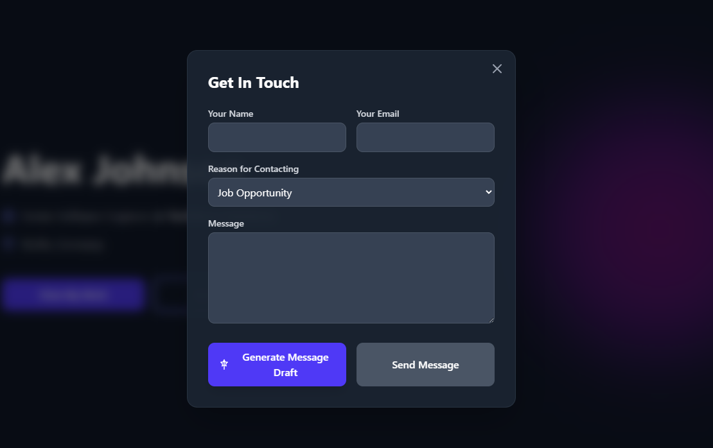
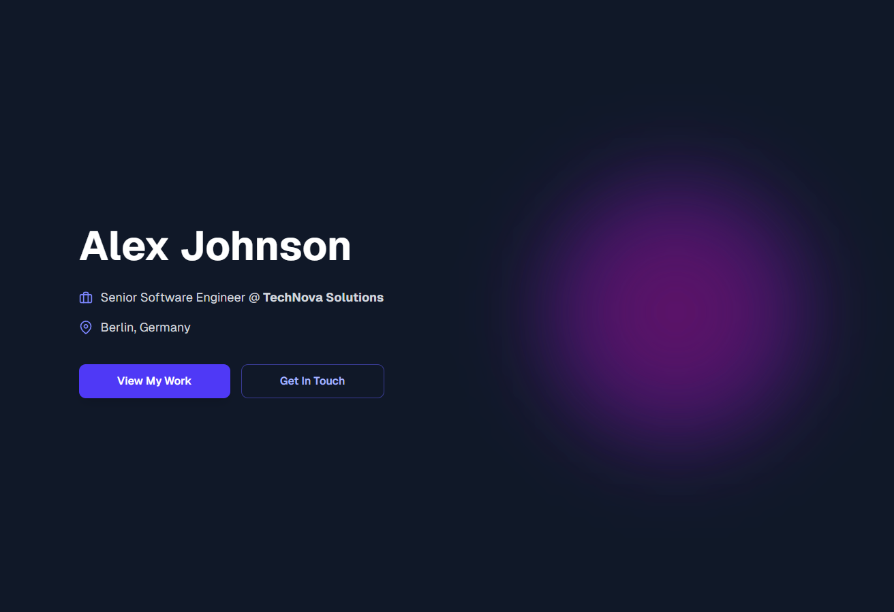

# react-hero-banner-with-gemini

A tiny demo project showing a hero banner with a modal contact form and Gemini integration. You can use this as a template for your own portfolio website.

## ContactModal component

Location: `components/contact-modal.tsx`

What it is and does
- Presents a modal UI with fields for visitor name, email, reason for contacting (select), and a message textarea.
- Includes a "Generate Message Draft" button that calls a small helper to request a short, professional message draft from a generative model (Gemini) and populate the message field.
- Includes a "Send Message" button (placeholder) where you can wire your email/send logic.

Key implementation notes
- Client component (uses `"use client"`) and local state via React `useState`.
- `fetchWithRetry(apiUrl, payload)` is a helper with exponential backoff that POSTs JSON to the configured API endpoint and returns a typed `GeminiResponse`.
- The code expects a Gemini-like response shape and safely reads the first candidate's first part text to populate the message.
- Errors are surfaced to the user via an `error` state string and a small inline message.

Props
- `user: { name, occupation, employer, location }` — used to craft the system prompt so the generated message is personalized.
- `isOpen: boolean` — whether the modal is visible.
- `onClose: () => void` — callback to close the modal.

Gemini / API usage
- The component builds a system prompt (with `user` and the visitor's inputs) and sends a minimal request payload to the generative endpoint. The code currently constructs a URL with an `apiKey` placeholder.
- You must provide a valid API key and (optionally) adjust the `apiUrl` to your project's production endpoint or proxy. Do NOT commit production secrets to source.

Accessibility and UX
- The modal stops backdrop clicks from closing it when interacting with the inner panel and closes on backdrop clicks.
- Buttons have clear labels and a visual disabled state while generating.

How to use
1. Import and render the modal in a parent component that toggles `isOpen`:

```tsx
import { ContactModal } from "./components/contact-modal"

// example
<ContactModal user={user} isOpen={open} onClose={() => setOpen(false)} />
```

2. Supply a real API key where `apiKey` is set inside the component or, better, move it to an environment variable and a server-side proxy so your key isn't exposed to the browser.

3. Wire the "Send Message" button to your chosen delivery mechanism (email API, server endpoint, etc.). The component currently prevents the form default submission and acts as a UI demo for drafting messages.

Files / visuals
- Screenshot of the modal UI (text overlay):



- Screenshot of the hero + modal (clean):



